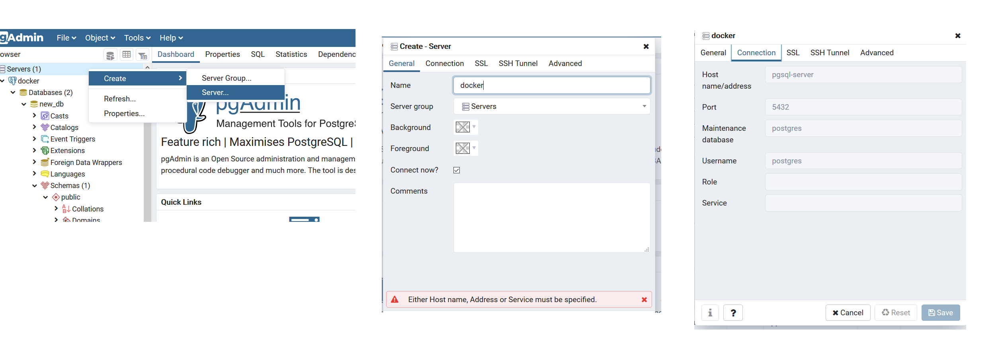

# tl-challenge

### Prerequisites
- Clone this repository to your local machine: 

```bash
git clone git@github.com:llemanh/tl-challenge.git
```

- Download [docker](https://docs.docker.com/get-docker/) for your OS.

### Run
- From your CLI go to to the root of the repository you just cloned.
- Make sure Docker Desktop is up and running.
- Run the following command:

```bash
docker-compose up --build
```

This can be a quite slow as the wikipedia data is huge (~30mn). 

### Connect to PG

- Go to: http://localhost:8080
- username: postgres@postgres.com
- password: password
- Follow the step below to create a connection:



### Methodology

The kaggle dataset was downloaded and stored in the repository while the wikipedia dump is downloaded, extracted and parsed at each run. This process is pretty slow due to the volume of data. The xml is parsed using SAX. The data is then transformed and loaded into PG. 

### Improvements

The process of downloading and parsing the xml everytime is very slow. Ideally we should store the whole dataset somewhere and only process new data. Furthermore we should add some schema tests to ensure the quality of the data we are downloading. 


