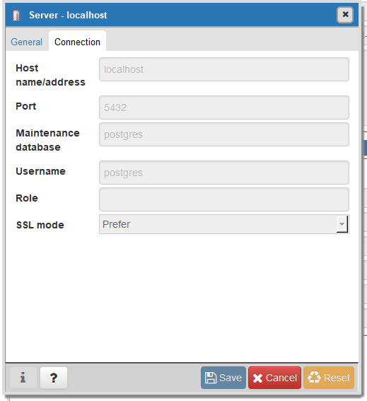

# tl-challenge

### Prerequisites
- Clone this repository to your local machine: 

```bash
git clone git@github.com:llemanh/tl-challenge.git
```

- Download [docker](https://docs.docker.com/get-docker/) for your OS.
- Download [pgadmin](https://www.pgadmin.org/download/) for your OS.

### Run
- From your CLI go to to the root of the repository you just cloned.
- Make sure Docker Desktop is up and running.
- Run the following command:

```bash
docker-compose up --build
```

This can be a quite slow as the wikipedia data is huge. 

### Connect to PG

- Open PgAdmin and set up a connection to localhost as follow:



### Improvements

Using python to process the data is not ideal. Python could be leveraged to download the data and drop them into a data lake. The data could be then loaded as raw into a cloud warehouse and processed with SQL. 


